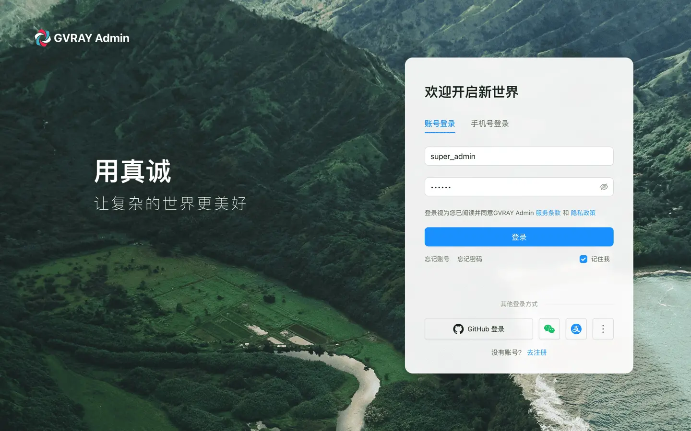

# GVRAY Admin

**简体中文** | [English](README.md)

🚀 基于 **NestJS 11**、**TypeScript**、**Prisma**、**MySQL**、**Redis** 构建的企业级后台管理脚手架，内置 **RBAC 权限管理**、**JWT 认证**、**Swagger/OpenAPI**、**Docker 部署** 与 **AI 开发支持**，可直接作为企业后台项目的 **Starter Template**。


<p align="center">
  
  
  
</p>

## ✨ 特性亮点

- 🔐 **RBAC 权限体系** —— 动态权限扫描、菜单权限、API 权限、权限缓存，开箱即用
- 🛡️ **JWT 双 Token 认证** —— Access Token / Refresh Token、Passport、bcrypt 密码加密
- ⚡ **Redis 深度集成** —— 会话管理、在线用户、接口限流、分布式锁、Pub/Sub、声明式缓存
- 🏗️ **NestJS 11 + TypeScript** —— 模块化架构、依赖注入、严格类型检查
- 📝 **Prisma 6 ORM** —— 类型安全查询，Migration / Seed / 事务全支持
- 📄 **Swagger / OpenAPI** —— 自动生成文档，Bearer Token 在线调试
- 🏢 **组织架构** —— 用户 / 角色 / 部门 / 岗位完整体系
- 🔑 **多方式登录** —— 用户名、邮箱、手机号、User ID
- 🛡️ **安全防护** —— CORS、统一异常、参数校验、日志脱敏、密码哈希
- 🐳 **Docker 优先** —— 开发 / 测试 / 生产三套配置，支持滚动更新
- 🤖 **AI Ready** —— 内置 `CLAUDE.md` 与模块化知识库，Claude Code / Cursor / Copilot 直接用
- 🎯 **规范化工程** —— ESLint、Prettier、统一响应格式、完整种子数据

## 🛠️ 技术栈

NestJS 11 · Prisma 6 · TypeScript 5 · MySQL 8 · Redis 6 · Swagger · Docker

## 🚀 快速开始

### 环境要求

- Node.js >= 20
- pnpm >= 9（Corepack 内置，`corepack enable` 即可）
- MySQL >= 8.0
- Redis >= 6.0
- Docker（可选）

```bash
git clone https://github.com/gvray/gvray-admin.git && cd gvray-admin

pnpm install
cp .env.example .env

# 方式一：Docker 启动 MySQL + Redis
docker compose -f docker-compose.dev.yml up -d mysql redis

# 方式二：已有本地 MySQL + Redis，配置 .env 后跳过上一步

pnpm prisma migrate dev
pnpm prisma db seed
pnpm start:dev
```

- 应用：`http://localhost:3000`
- Swagger：`http://localhost:3000/api`（点击 Authorize，输入 `Bearer <accessToken>`）

## 👤 默认账户

> ⚠️ 仅用于本地开发，请勿用于生产。

| 角色    | 用户名          | 邮箱                  | 密码     |
| :------ | :-------------- | :-------------------- | :------- |
| 超级管理员 | `super_admin` | `super@example.com`   | `123456` |
| 管理员   | `admin`        | `admin@example.com`   | `123456` |
| 游客    | `guest`         | `guest@example.com`   | `123456` |

## 📁 项目结构

```
src/
├── core/       # 基础设施（decorators / guards / interceptors / filters / pipes）
├── modules/    # 业务模块（auth / system / dashboard / profile）
├── prisma/     # Prisma Module / PrismaService
├── redis/      # Redis 基础设施（缓存 / 限流 / 分布式锁）
├── shared/     # 共享层（constants / DTOs / utils / BaseService）
└── main.ts

prisma/         # Schema + 迁移 + Seed
docs/           # 项目文档
docker/         # Docker 部署配置
.claude/        # AI 知识库
```

> 📖 [完整项目结构 →](docs/project-structure.md)

## ❓ 为什么选 GVRAY Admin

普通 NestJS Starter 只给骨架，企业项目真正需要的部分还得自己搭。

| | 普通 Starter | **GVRAY Admin** |
|:---|:---:|:---:|
| RBAC 权限 + 动态扫描 | ✗ | ✅ |
| JWT 双 Token + 刷新 | ✗ | ✅ |
| Redis 限流 / 分布式锁 | ✗ | ✅ |
| 完整组织架构（部门/岗位） | ✗ | ✅ |
| Swagger 自动文档 | 基础 | ✅ 含在线调试 |
| Docker 三套环境 | ✗ | ✅ |
| AI 助手上下文 | ✗ | ✅ |
| 规范化目录 + 种子数据 | ✗ | ✅ |

## 🗺️ Roadmap

- [x] JWT 双 Token 认证
- [x] RBAC 权限体系 + 动态扫描
- [x] Prisma ORM + 完整 Seed
- [x] Redis 深度集成
- [x] Swagger / OpenAPI
- [x] Docker 三套部署
- [x] 用户 / 角色 / 部门 / 岗位管理
- [x] 菜单管理
- [x] 系统配置项
- [x] 字典管理
- [x] 公告通知
- [x] 操作日志 / 登录日志
- [x] 在线用户
- [x] 系统监控（服务器 / 缓存）
- [ ] WebSocket 实时通知
- [ ] 定时任务
- [ ] 文件存储
- [ ] 多租户
- [ ] OpenTelemetry
- [ ] Kubernetes 部署

## 🤖 AI 编程支持

- [`CLAUDE.md`](./CLAUDE.md) — Claude Code 自动加载入口
- [`.claude/project/`](./.claude/project/) — 按需知识库（架构 / DTO / 权限 / 响应格式）

> 📖 [AI 开发指南 →](docs/ai-development.md)

## 📚 文档

| 文档 | 说明 |
|:---|:---|
| [📖 功能特性清单](docs/features.md) | 完整功能模块与开发进度 |
| [🐳 Docker 部署指南](docs/deployment.md) | 开发 / 测试 / 生产部署、滚动更新 |
| [📋 统一响应格式](docs/response-format.md) | API 响应规范 |
| [⚙️ 系统配置项](docs/configs.md) | 前后端配置关联 |
| [🏗️ 项目结构详解](docs/project-structure.md) | 目录结构与模块说明 |
| [🧪 API 测试指南](docs/api-testing.md) | Swagger 调试与认证流程 |

## 🌐 配套前端

- [gvray-react](https://github.com/gvray/gvray-react) — React + Umi
- **gvray-vue**（开发中）— Vue 3 + Vite + Pinia + Element Plus
- **gvray-vite**（开发中）- React + Vite
- **gvray-next**（筹备中）- Nextjs

## 🤝 参与贡献

欢迎提 Issue、PR 或功能建议。如果这个项目对你有帮助，**点个 ⭐ Star 是最大的支持！**

本项目采用 [MIT 许可证](LICENSE) 开源。
